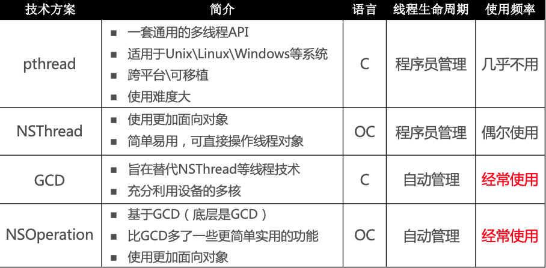
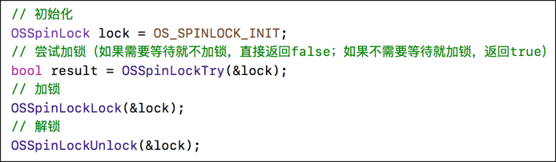
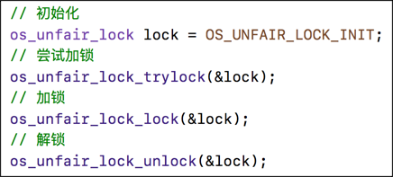
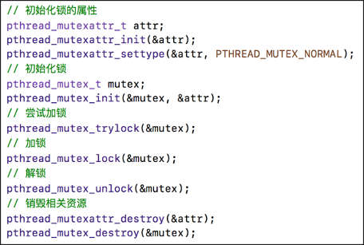
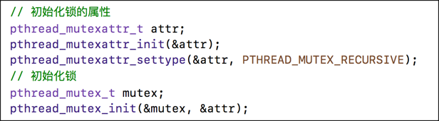
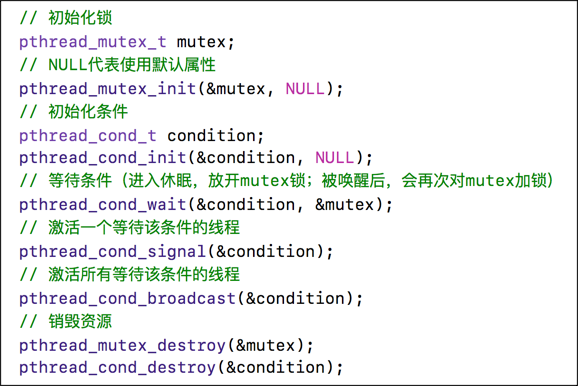
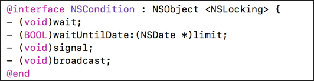
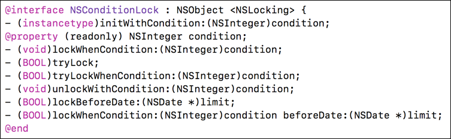
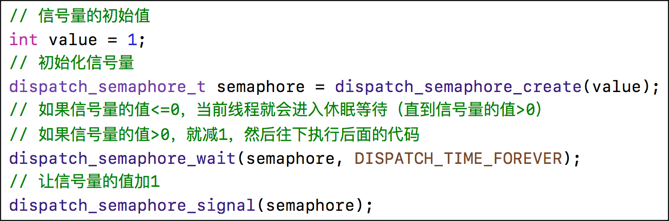
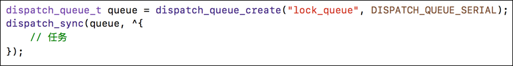

#IOS多线程的基本使用

###本篇文章主要针对日常开发中常用的多线程的多种解决方案进行的梳理

[百度百科-GCD](https://baike.baidu.com/item/GCD) 

Grand Central Dispatch（GCD） 是 Apple 开发的一个多核编程的较新的解决方法。它主要用于优化应用程序以支持多核处理器以及其他对称多处理系统。它是一个在线程池模式的基础上执行的并发任务。在 Mac OS X 10.6 雪豹中首次推出，也可在 iOS 4 及以上版本使用。

iOS常见的多线程的解决方案

作为iOS开发来说，使用最多的就是GCD和NSOperation

多线程中常用的术语

* 同步：在当前线程执行任务，不具备开启新线程的能力
* 异步：在新的线程执行任务，具备开启新线程的能力
* 串行：一个任务执行完毕后，在执行下一个任务
* 并行：多个任务并发执、同时执行
* 队列：排队执行任务 FIFO（先进先出）执行
* 死锁：使用sync函数往当前串行队列中添加任务，会卡住当前的串行队列（产生死锁）

比如如下代码便会产生死锁：

		NSLog(@"1");
    		dispatch_sync(dispatch_get_main_queue(), ^{
      		NSLog(@"2");
	   	});
	   	NSLog(@"3");
    	
因为任务放到主队列执行，需要等待上一个任务执行完毕才能执行, 但是上一个任务也是在主线程执行执行，他们想户等待，因此产生死锁
各种队列的执行效果

在iOS移动设备终端使用多线程本质是利用多核处理器并发处理任务，不可避免的会对同一块内存进行操作，使用不当可能就会发生资源争抢引发一系列的血案
比如多个线程同时写入同一块变量、同时写入同一个文件，便会发生数据错乱和数据安全等问题

既然不能同时写入同一块内存或者文件，那就好办了，那就限制一下就可以了，让他们不同时写入就可以了
就好比你们班里面发奖品，每个人都有份，但是领奖品需要本人去讲台签字才行，这样很多同学肯定一哄而上去讲台进行签字ABCD等同学进行找名字，谁先找到就去签字，所以找名字是可以并发的，而且没有修改文件，数据是安全的，但是如果A和C都找到了自己的名字，
那就谁先争夺了签字的权利，就谁先签字，那么其他的人就算找到了自己的名字也需要等待签字的人签完才能进行签字，这样就可以保证了数据安全

对于iOS程序来说，业界也创造了很多保证线程安全的方案，线程锁机制

* OSSpinLock 
* os_unfair_lock 
* pthread_mutex 
* dispatch_semaphore 
* dispatch_queue(DISPATCH_QUEUE_SERIAL) 
* NSLock 
* NSRecursiveLock 
* NSCondition 
* NSConditionLock 
* @synchronized 

###下面逐一介绍一下上述锁
####OSSpinLock

叫做”自旋锁”，等待锁的线程会处于忙等（busy-wait）状态，一直占用着CPU资源
目前已经不再安全，可能会出现优先级反转问题：优先级较高的线程一直占用资源，因为优先级较高，系统优先分配资源，优先级较低的几乎得不到资源，可能永远不会执行
基本使用

####os_unfair_lock
os_unfair_lock用于取代不安全的OSSpinLock ，从iOS10开始才支持
从底层调用看，等待os_unfair_lock锁的线程会处于休眠状态，并非忙等

基本使用

####pthread_mutex
mutex叫做”互斥锁”，等待锁的线程会处于休眠状态
传入settype 传NULL或者传入PTHREAD_MUTEX_NORMAL代表普通互斥锁
基本使用

####pthread_mutex
传入settype传NULL或者传入PTHREAD_MUTEX_RECURSIVE代表递归锁
基本使用

####pthread_mutex 
设置pthread_cond_init 代表条件锁
基本使用

####NSLock
NSLock对mutex普通锁的封装

####NSRecursiveLock
NSRecursiveLock也是对mutex递归锁的封装，API跟NSLock基本一致

####NSCondition
NSCondition是对mutex和cond的封装
基本使用

####NSConditionLock
NSConditionLock是对NSCondition的进一步封装，可以设置具体的条件值
基本使用

####dispatch_semaphore
semaphore叫做”信号量”
信号量的初始值，可以用来控制线程并发访问的最大数量
信号量的初始值为1，代表同时只允许1条线程访问资源，保证线程同步
基本使用

####dispatch_queue
直接使用GCD的串行队列，也是可以实现线程同步的
基本使用

####@synchronized
@synchronized是对mutex递归锁的封装
@synchronized(obj)内部会生成obj对应的递归锁，然后进行加锁、解锁操作

###几种锁的区别
自旋锁：忙等，内部实现是个while循环
递归锁：允许同一个线程对递归锁进行加锁
互斥锁：等不到锁，进行休眠
条件锁：符合一定条件才能获得锁pthread_cond_wait(&_cond,&_mutex),等待pthread_cond_signal(&_cond)释放锁

###自旋锁和互斥锁的比较
以下情况使用自旋锁
1. 预计线程等待的事件很短
2. 加锁的代码经常被调用，但是竞争情况很少发生
3. CPU资源不紧张
4. 多核处理器

一下情况使用互斥锁
1. 预计线程等待事件比较长
2. 单核处理器
3. 临界区有IO操作
4. 临界区代码复杂或者循环量较大
5. 临界区竞争非常激烈	

